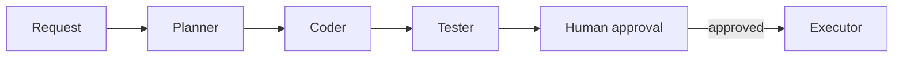

# Multi-Agent Coding Assistant

A human-gated orchestration boundary for planner, coder, and tester agents. The MVP exposes a deterministic plan and requires approval before execution; LangGraph or CrewAI can provide the runtime graph later.

Run `pip install -r requirements.txt` and `uvicorn app.main:app --reload`. POST `{"request":"add rate limiting"}` to `/tasks`.
